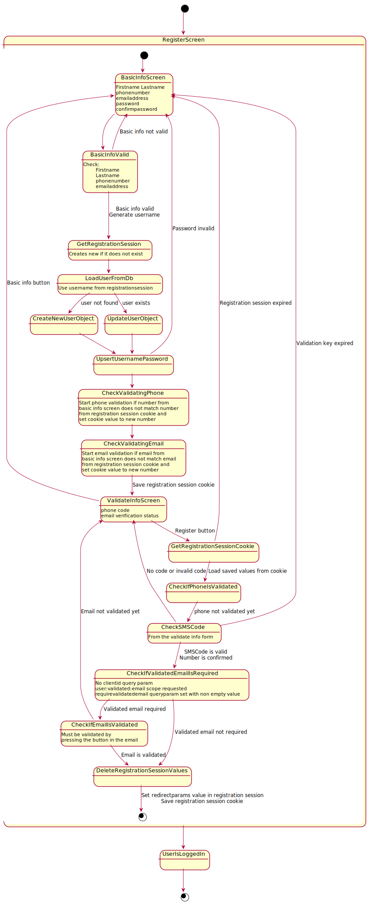

# Registration flow

Documents about the registration flow and how it can be improved

## Current registration flow

The diagram below does not include a reference to the `magic sms link` as it has currently been removed from the sms.
One potential issue is that the password is validated as it is saved. This should probably be separated so that the validation
occurs after the email validation and before a user object is created.

